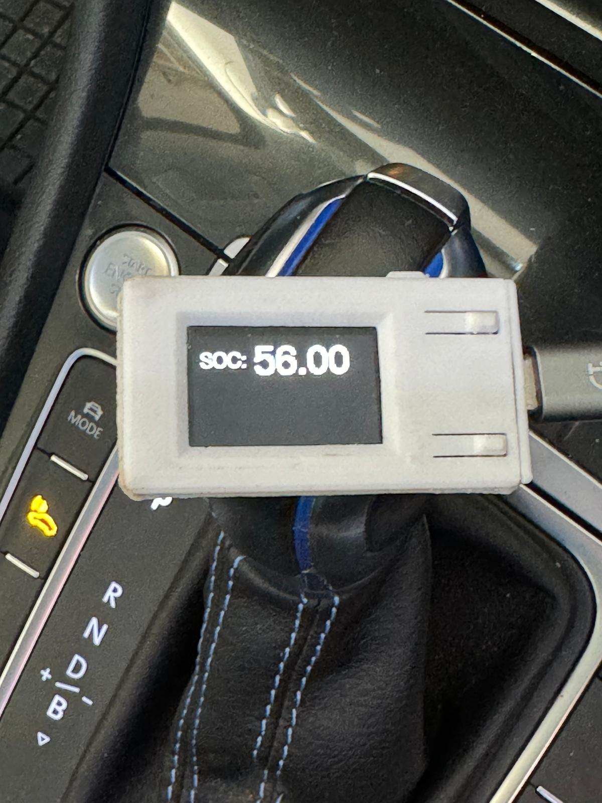
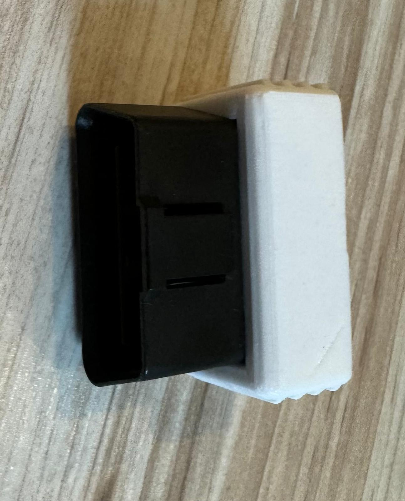

# Real-Time Battery Percentage Display for e-Golf and e-Up

This project provides a real-time display of the battery percentage for the Volkswagen e-Golf and e-Up electric vehicles.


## Features
- WIFI or Bluetooth Dongle
- Real-time battery percentage display
- Easy integration with e-Golf and e-Up

## Screenshots




## Support

If you find this project useful, you can support its development:

[](https://buymeacoffee.com/manuel833)

[Donate via PayPal](https://paypal.me/mherzog45?country.x=AT&locale.x=de_DE)

## Installation


### ⚠️ Attention ⚠️

**You need version 2.0.17 of the `arduino-esp32` library from ESPressif.** If you use any other version, the project **will not work**! 😬

### Requirements
- Arduino IDE
- Libraries: `ELMduino.h`, `TFT_eSPI.h`, `WIFI.h`
- [Bluetooth ELM327 OBDII adapter](https://amzn.to/4eJq7Wn)
- [WIFI ELM327 OBDII adapter](https://amzn.to/3XIxXJQ)
- [TTGO LoRa32-OLED ESP](https://amzn.to/3ROV4ip)

### ELMduino.h
This is a simple yet powerful library to effortlessly interface your Arduino with an ELM327 OBD-II scanner. With this library, you can query any and all OBD-II supported PIDs to collect a wide variety of car data (i.e. speed, rpm, engine temp, etc). Also, you can use ELMduino to view and clear your car's trouble codes - no need to go to AutoZone anymore!

[ELMduino github](https://github.com/PowerBroker2/ELMduino)

### Steps

1. Clone or download this repository:
   ```bash
   git clone https://github.com/manuel833/e-Golf-SOC-Display.git
   ```

2. Make the following changes in the code Bluetooth Version:
   ```cpp
   const char* DEVICE_NAME = "Golf"; // Gerätenamen des ESP
   const char* OBDII_NAME = "OBDII"; // OBDII Namen
   const char* BLUETOOTH_PIN = "1234"; // OBDII Bluetooth pin
   ```
2.1. Make the following changes in the code WIFI version:
   ```cpp
   const char* ssid = "WIFI_OBDII"; //WIFI name of the OBDII Dongle
   const char* password = "your-password"; //WIFI password of the OBDII Dongle
   ```
3. Open the Arduino IDE and install the required libraries:
   - Go to **Sketch** -> **Include Library** -> **Manage Libraries...**
   - Search for `ELMduino` and install it
   - Search for `TFT_eSPI` and install it
   - Search for `BluetoothSerial` and install it

4. Upload the code to your TTGO LoRa32-OLED board.

5. Plug in your ELM327 Bluetooth OBDII adapter into your e-Golf or e-Up.

6. Power on the TTGO LoRa32-OLED display and it should connect to the OBDII adapter and start displaying the battery percentage.


## License

This project is licensed under the MIT License. See the `LICENSE.md` file for more details.
```

This version provides a clear and concise set of instructions for users to follow, ensuring they can easily set up and use the real-time battery percentage display for their e-Golf and e-Up vehicles.
